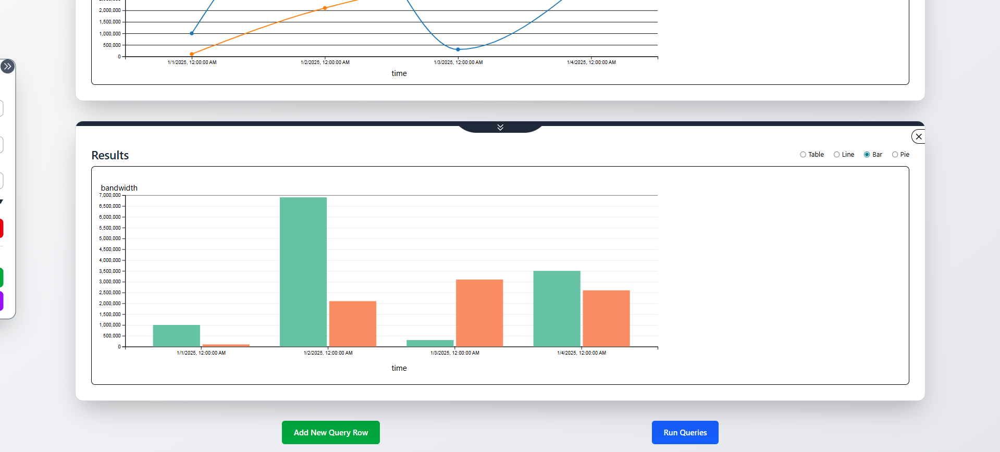
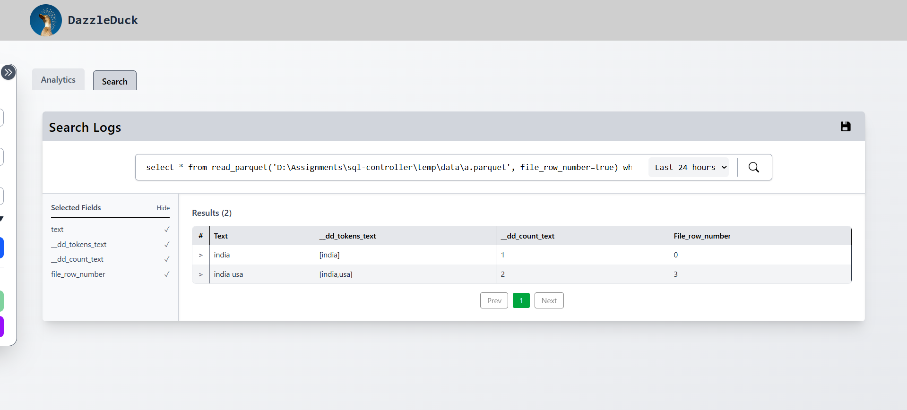

# DazzleDuck Arrow JS UI

The **DazzleDuck Arrow JS UI** is a modern, browser‑based frontend designed to interact with the **DazzleDuck SQL HTTP Server**. It provides an interactive environment for executing SQL queries, visualizing results, searching ingested data, and managing sessions — all powered by **Apache Arrow** for high‑performance data transfer.

This UI is built for **developers, data engineers, and analysts** who want fast, transparent access to DuckDB‑powered analytics without installing heavyweight desktop tools.

---

## Purpose

The Arrow JS UI serves as:

- A **developer console** for DazzleDuck SQL Server
- A **visual analytics tool** for Arrow‑based result sets
- A **reference frontend** demonstrating how to consume DazzleDuck’s HTTP APIs

It is intentionally designed to stay close to the underlying APIs, exposing real server behavior rather than abstracting it away.

---

## Core Capabilities

### Secure Connection Management

- JWT‑based authentication via `/v1/login`
- Persistent session handling (no repeated logins)
- Advanced claim support (org, database, schema, path, function)
- Automatic re‑authentication when connection context changes

### SQL Analytics Workspace

- Multi‑query execution with independent query rows
- Parallel query execution (no blocking)
- Cancel support for long‑running queries
- Arrow‑native result handling for large datasets

### Visualization & Exploration

- Table rendering optimized for large Arrow batches
- Built‑in charting support:

  - Line charts
  - Bar charts
  - Pie charts

- Instant re‑rendering on query re‑execution

### Search & Log Exploration

- Time‑range based filtering (24h / 7d / 30d)
- Paginated result browsing
- Expandable rows for raw JSON inspection
- Field‑level visibility controls

### Session Management

- Save full sessions as JSON (queries + connection metadata)
- Restore sessions across browsers or machines
- No credentials stored (passwords are never persisted)

---

## High‑Level Architecture

```
Browser (Arrow JS UI)
        │
        │ HTTP + Arrow IPC
        ▼
DazzleDuck SQL HTTP Server
        │
        │ DuckDB + Arrow
        ▼
Warehouse (Parquet / Arrow / Files)
```

- Queries are executed remotely on the server
- Results are streamed back as **Arrow IPC**
- The UI renders Arrow data directly in the browser

---

## Technology Stack

### Frontend

- **React 18**
- **Vite** (fast dev + build)
- **Tailwind CSS** (utility‑first styling)
- **Arrow JS** (binary columnar data handling)
- **Axios** (HTTP client)

### Backend Integration

- DazzleDuck SQL HTTP API (`/v1/*`)
- JWT authentication
- Arrow IPC streaming

---

## Typical Use Cases

- Explore Parquet datasets stored in a DazzleDuck warehouse
- Debug and validate SQL queries during development
- Visualize analytical results without exporting data
- Inspect ingestion results and transformations
- Demonstrate DazzleDuck capabilities to users or stakeholders

---

## What This UI Is (and Isn’t)

**It is:**

- A fast, transparent analytics UI
- A reference implementation for Arrow‑based clients
- A production‑usable internal tool

**It is not:**

- A full BI replacement (Tableau / Superset)
- A query abstraction layer
- A data modeling tool

---

## Screenshots

### Home UI


---

### Results in Table


---

### Results in Charts



---

### Search Tab



---

## Next Steps

- Learn how the UI is structured → **Architecture**
- Get it running locally → **Setup**
- Execute queries & visualize data → **Usage**
- Understand chart behavior → **Charts**
